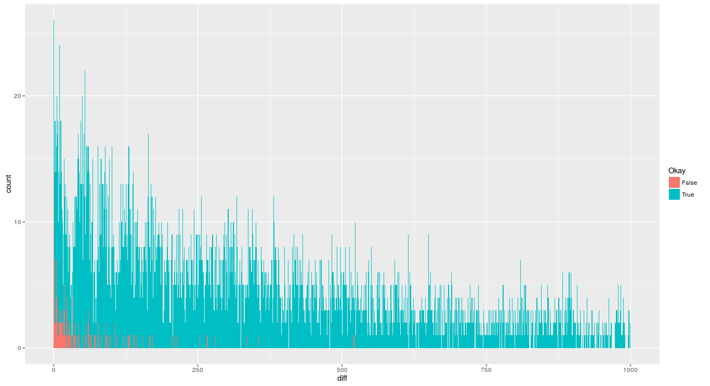
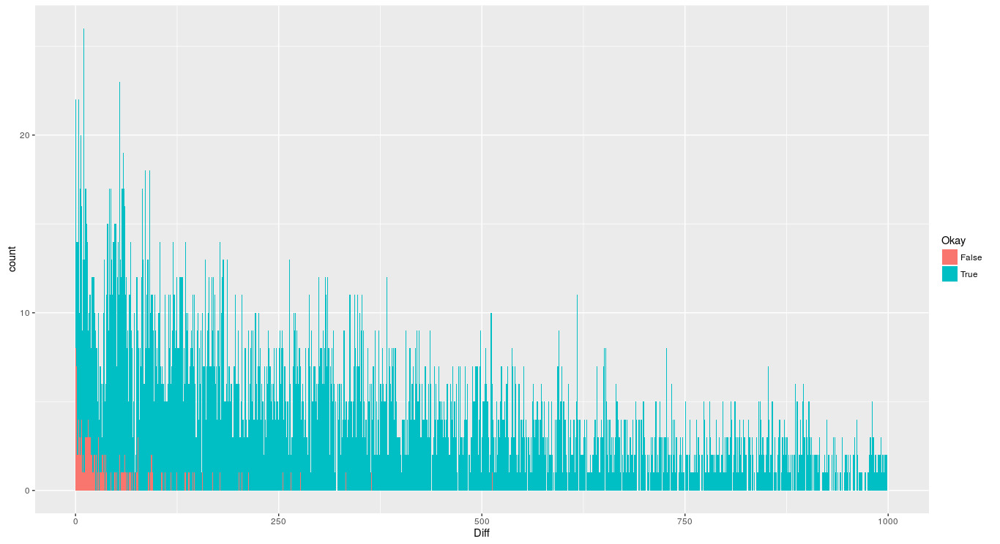

.. _analysis:

##########
 Analysis
##########

Final Accuracy: 97.80%

- By not discarding stop words.  (Run time seems to be okay for enron
  datasets.)

********************************
 Accuracy for Plain Naive Bayes
********************************

Accuracy: 97.58%

Method of Measurement
=====================

Ratio of number of successful classifications to total classification
attempts.

Code prints::

   Okay{sep}Pred{sep}True{sep}LL (Spam){sep}LL (Ham){sep}DocName

Example::

   Okay    Pred    True    LL (Spam)       LL (Ham)        DocName
   False   spam    ham     -814.822544882  -904.500127169  ../dat/enron6/ham/2768.2001-01-26.lokay.ham.txt
   True    ham     ham     -1354.66148833  -1195.80856045  ../dat/enron6/ham/3566.2001-05-08.lokay.ham.txt

"Diff" Formula
==============

We define a metric call :dfn:`diff` as follows:

.. math::

   diff_word  = abs( log(P(w|C_1)) - log(P(w|C_2)) )
   diff_class = abs( log(P(C_1)) - log(P(C_2)) )

where:

`w`
   word

`C_1` and `C_2`
   Classes

This gives an estimate of how good the word `w` is in predicting whether the
document belong to class `C_1` or class `C_2`.  As it is directly added into
the log likelyhood formula (for the corresponding classes).

Observations
============

- Histogram of Diff
- Oppurtunities for Improvement

Histogram of Diff
-----------------

   Histogram of Diff

Key points-

- Separation looks "strong": Blue (success) is towards right; few Red (fail)
  are towards left.
- Amount of improvement required: Most of the Red (fail) cases have Diff value
  between classes (`diff_class`) less than 25.

Oppurtunities for Improvement
-----------------------------

Looks like quite a few of the Red (fail) cases seems to have short emails.
So, we could focus accuracy improvement to short emails.

*********************
 Tweaking Stop Words
*********************

Observation
===========

- Upper Bound on Improvement from Stop Words
- Relevant Stop Words for Short Emails
- Relevant Stop Words

Upper Bound on Improvement from Stop Words
------------------------------------------

The accuracy improves to 97.80% (increase in 0.22% points) if we do not
excluded stop words.  Run time seems to be okay for enron datasets.

Hence, we have found an upper bound on the benefit that we can get by not
excluded stop words.  We tried to exclude as many stop words as possible
(not excluding only the most relevant stop word), however we could only
improve the accuracy to 97.68% (increase in 0.10% points).

Relevant Stop Words for Short Emails
------------------------------------

We see a sudden jump of diff_word from 4.6 to 35.5.  Although, the
occurances of words with diff_word > 35 are small, 35 is greater than the
our improvement target of 25 (see `Histogram of Diff`_).  So, even one
occurance of this word in a short email might help classify the email
correctly.

See :file:`relevant-stop-words-for-short-emails.txt`. ::

   $ tail -n15 relevant-stop-words-for-short-emails.txt
   # Stop word   # DocFreq # log_prob_spam # log_prob_ham  # diff_word
   hopefully       219     -13.7028590833  -9.84597040563  3.85688867767
   que             95      -8.86393516688  -13.4835565654  4.61962139847
   downwards       1       -50.8451247611  -15.2753160346  35.5698087265
   noone           2       -50.8451247611  -14.582168854   36.2629559071
   awfully         3       -50.8451247611  -13.8890216735  36.9561030876
   whence          2       -14.1083241914  -51.3189694237  37.2106452323
   selves          4       -13.4151770108  -51.3189694237  37.9037924129
   whither         4       -13.4151770108  -51.3189694237  37.9037924129
   lest            5       -13.1920334595  -51.3189694237  38.1269359642
   inasmuch        6       -13.0097119027  -51.3189694237  38.309257521
   thence          6       -13.0097119027  -51.3189694237  38.309257521
   thereupon       6       -13.0097119027  -51.3189694237  38.309257521
   hereafter       12      -12.3165647222  -51.3189694237  39.0024047015
   hither          13      -12.2365220145  -51.3189694237  39.0824474092
   theres          15      -11.9682580279  -51.3189694237  39.3507113958

Relevant Stop Words
-------------------

See :file:`relevant-stop-words.txt`.  This is sorted by the first column.  The
first column is diff_word * DocFreq.  The better this value, the better a stop
word is in predicting the class.

We tried including some words but got only limited success.  For example, not
removing "the" and "you" yeilded gains, but not removing "your" did not.  See
:file:`relevant-stop-words.txt`. ::

   $ tail relevant-stop-words.txt 
   # product # StopWord DocFreq  # log_prob_spam # log_prob_ham  # diff_word
   6713.44   our         8829    -5.46229812815  -6.22268265864  0.760384530489
   6820.36   the         20862   -3.5796070153   -3.25267956681  0.326927448492
   7168.24   re          6232    -7.28885382729  -6.13862220278  1.15023162452
   7247.95   would       6040    -7.09665944903  -5.8966685172   1.19999093184
   8650.8    am          6229    -7.36603335215  -5.9772395483   1.38879380385
   8691.75   here        6259    -6.07223602231  -7.46091640078  1.38868037847
   8878.77   on          14124   -5.34834169643  -4.71971165104  0.628630045384
   9533.27   thanks      5795    -8.1044371243   -6.45935247373  1.64508465057
   9998.84   you         17584   -4.33654112987  -4.90517420563  0.568633075758
   15750.5   your        12676   -4.64252797865  -5.88507369733  1.24254571868

Method
======

We use the logs provided by `Model Interpretability`_ to understand the most
relevant stop words.

***********************
 Tweaking Punctuations
***********************

Observations
============

- Consequtive Punctuations Matter
- Individual Punctuations are Irrelevant

Consequtive Punctuations Matter
-------------------------------

We can see that consequtive punctuations can help in identifying spam.  See
:file:`conseq-puncs-matter.csv`. ::

   $ tail conseq-puncs-matter.csv 
   # word_diff # word      # DocFreq # word_cnt_spam # word_cnt_ham
   49          ???????????   8         49.0          2.22044604925e-16
   53          ?????????    10         53.0          2.22044604925e-16
   73          ????????     11         73.0          2.22044604925e-16
   81          ???????      13         81.0          2.22044604925e-16
   106         ??????       19        106.0          2.22044604925e-16
   144         ?????        16        144.0          2.22044604925e-16
   182         ????         17        182.0          2.22044604925e-16
   298         ?f?           7        298.0          2.22044604925e-16
   384         ??           20        384.0          2.22044604925e-16
   580         ???          29        580.0          2.22044604925e-16

Individual Punctuations are Irrelevant
--------------------------------------

Not excluding punctuations does not improve accuracy.  Instead, it seem to
reduce the accuracy (reason unknown).

One exception was for `!`.  Ignoring `!` did improve accuracy.  However, i'm
not sure if this is real improvement or just overfitting.

*****************************
 Ignoring Non-decisive Words
*****************************

While calculating the log probability for each class exclude words that have a
small word_diff.

   Histogram of Diff for Large word_diff

************************
 Implementation Details
************************

Model Interpretability
======================

.. code-block:: python

   def print_freqs(self, tokens)

For a test document, that contains list of tokens, ``w``, print the
words' log probability, :math:`log(P(w|C_i)` in the following format::

   {token}{sep}{df}{sep}{log_prob_spam}{sep}{log_prob_ham}{sep}{diff}

This is useful for example to examine cases where the model has misclassified
to understand which are the most relevant words. ::

   # For enron6/ham/3859.2001-06-27.lokay.ham.txt

   # Word     # DocFreq  # log_prob_spam # log_prob_ham  # word_diff
   found       969      -8.08912020293  -8.26547188364  0.176351680711
   monster     20       -11.5306688801  -13.6904219011  2.15975302101
   thought     783      -8.71139304391  -8.26400453195  0.447388511956
   you         17584    -3.89895198208  -4.41889236084  0.519940378761
   job         688      -8.78415239819  -7.97999488375  0.804157514438
   searching   108      -9.72915323594  -11.6109803594  1.8818271235
   comments    961      -9.92123096768  -7.60972622029  2.31150474739

